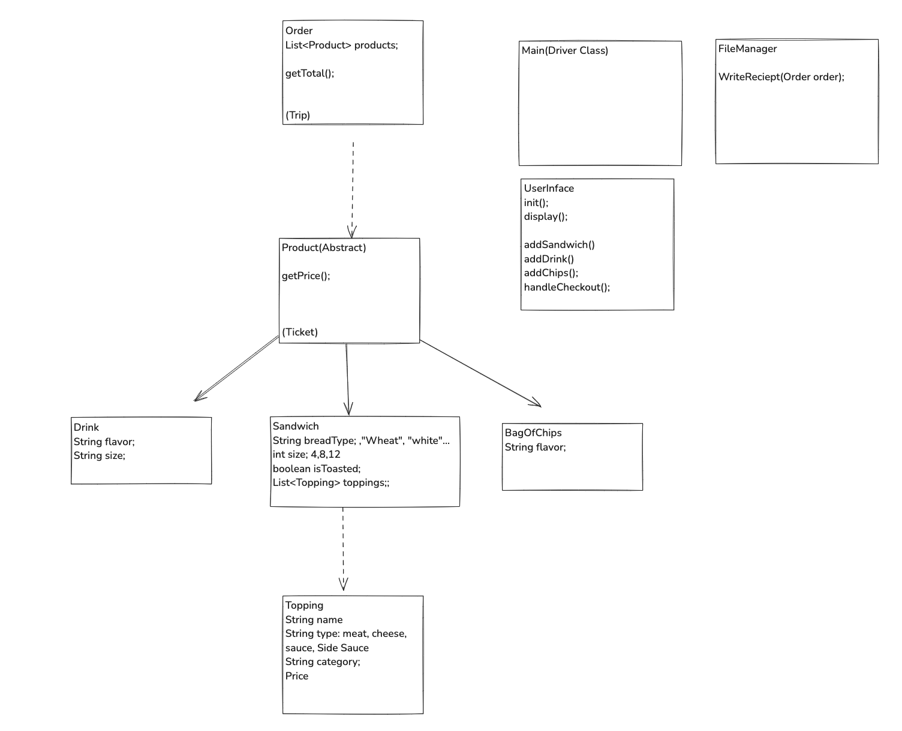
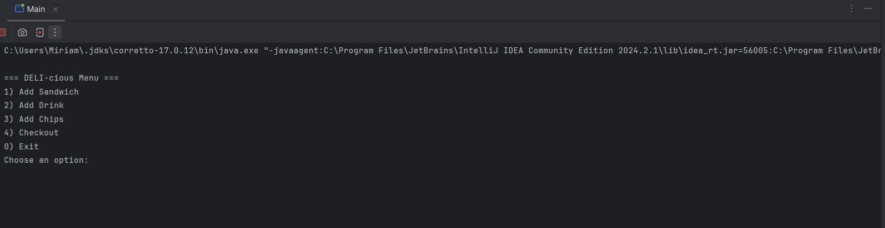
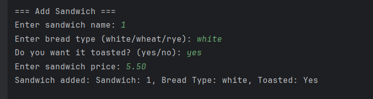
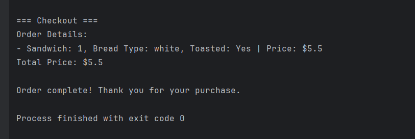
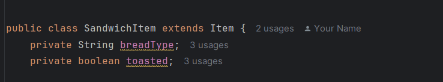

# DELI-cious Sandwich Shop CLI Application
Welcome to the DELI-cious Sandwich Shop CLI Application! This is a Java-based point-of-sale system for a customizable sandwich shop, designed to let customers create and order their ideal sandwiches. The app supports a range of options for sandwich customization, adding sides like drinks and chips, and generates a receipt for each completed order.

# Features
1) Create custom sandwiches with different bread, toppings, and sizes.
2) Add sides, such as drinks and chips, to your order.
3) View order summary with a calculated total.
4) Generate and save a receipt for each order with a unique timestamp
Simple CLI interface for easy navigation.

# Signature Sandwich
- Predefined sandwich templates with popular combinations.
- Customers can customize further by adding/removing toppings.

# Usage
1) Launch the Application: Run Main.java to start.
2) New Order: From the home screen, start a new order.
3) Add Items: Add a sandwich, drink, or chips. Customize your sandwich by selecting size, bread, toppings, and whether it should be toasted.
4) Checkout: View the order summary and confirm to save the receipt to a receipts folder.
5) Exit: Choose the option to exit when done.

# Class Structure
Key Classes:
1) Sandwich: Represents a customizable sandwich with size, bread type, and toppings.
2) Order: Represents an order containing sandwiches, drinks, and chips.
3) Topping: Abstract class for regular and premium toppings.
4) Receipt: Generates a receipt file for each completed order.
5) Main: CLI interface for managing orders.

# Class Diagram

# Screenshots
1) The main menu screen

2) A sample sandwich customization screen

3) The checkout screen with an order summary

# Interesting Code

Explanation:
SandwichItem is a specialized version of Item, meaning it inherits common properties and behaviors of Item.
It has two additional attributes:
1) breadType: Stores the type of bread (e.g., "White" or "Wheat").
2) toasted: A true or false value indicating if the sandwich is toasted.
This class is designed to represent a sandwich with specific details, while reusing the general features of an Item.

